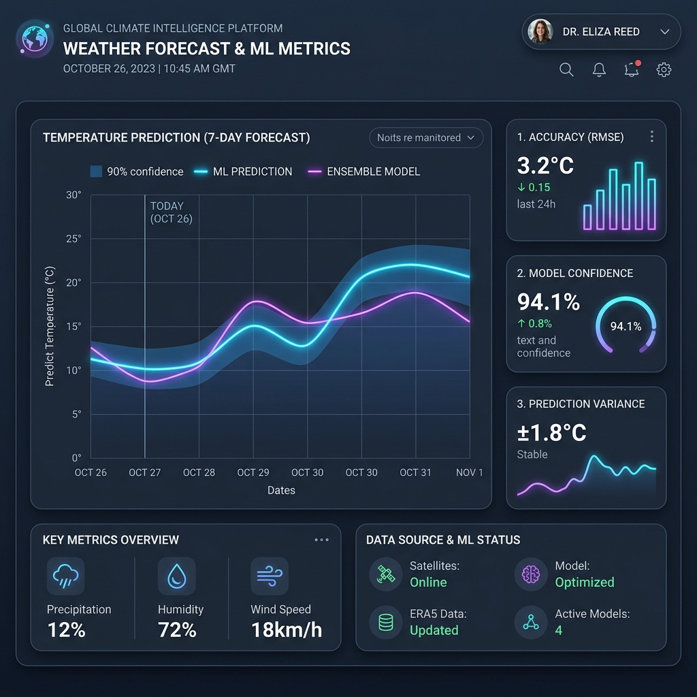

<div align="center">

# ⛈️ AtmosForge

### Multivariate Meteorological Time Series Forecasting
#### A Production-Grade Deep Learning Benchmarking Framework

[](https://python.org)
[](https://pytorch.org)
[](https://mlflow.org)
[](https://fastapi.tiangolo.com)
[](https://opensource.org/licenses/MIT)

> An institutional-grade benchmarking framework that systematically evaluates 6 deep learning architectures (including TFT, N-HiTS, and PatchTST) for weather forecasting. Built with MLflow tracking, Optuna HPO, SHAP feature attribution, and deployed via an asynchronous FastAPI serving infrastructure.

</div>

---

## 🖼️ Visualizations

### 📊 Model Performance & Metrics Dashboard


---

### 🌲 SHAP Temporal Feature Importance


---

### 🔄 End-to-End MLOps Pipeline Architecture


---

## 🚀 Live Demo

Start the FastAPI inference server and explore the auto-generated Swagger UI locally:  
👉 `make serve` (Launches async server)  
👉 Visit `http://localhost:8000/docs` (Interactive API dashboard)

---

## ⚡ Key Features

- 🎯 **Unified Benchmarking:** Standardized evaluation of 6 architectures across 3 real-world datasets (Jena Climate, OpenMeteo, ERA5) and 4 forecast horizons.
- 📈 **State-of-the-Art Models:** Includes Temporal Fusion Transformers (TFT), PatchTST, and N-HiTS, alongside CNN-1D and LSTM/GRU baselines.
- ⚖️ **Rigorous Selection:** Automated Diebold-Mariano statistical tests at p < 0.05 for pairwise accuracy comparison.
- 🛡️ **Uncertainty Quantification:** Built-in quantile regression (q10, q50, q90) and conformal prediction for prediction interval generation.
- 🌲 **Interpretability:** Integrated SHAP-based temporal feature importance for analyzing meteorological drivers.
- 📊 **Full MLOps Tracking:** Every run, hyperparameter, and metric is versioned via MLflow with Bayesian search via Optuna.

---

## 📌 Project Overview

**AtmosForge** is an end-to-end framework designed to predict multivariate meteorological time-series. It ingests raw weather data, applies chronologically sound windowing, and trains deep learning models to predict future weather conditions with high accuracy and quantified uncertainty.

The goal is to demonstrate a **production-grade quantitative engineering workflow** — strictly adhering to rules preventing data leakage and look-ahead bias, culminating in robust evaluation pipelines, low-latency microservices, and reproducible artifacts.

### Pipeline Architecture
```text
[Raw Weather Data] → [Validation & Imputation] → [Temporal Feature Engineering]
                                                          ↓
                  [Purged Windowed DataLoaders] ← [Scaling & Splitting]
                                                          ↓
               [HPO via Optuna] ──► [Training + MLflow Tracking (AMP enabled)]
                                                          ↓
           [Evaluation: DM Test + CRPS + SHAP] ──► [Model Registry (FastAPI)]
```
> [!IMPORTANT]  
> **Critical Invariant:** The pipeline enforces strict chronological splitting (70% train / 15% val / 15% test). Normalizers and scalers are fitted **only** on the training set to prevent any forward data leakage.

---

## 🌍 Real-World Impact

This system simulates the infrastructure required by modern meteorological and energy operations:
- **Grid Stability:** Accurate weather forecasts are crucial for predicting renewable energy generation (solar/wind).
- **Extreme Weather Alerts:** Uncertainty quantification (quantile predictions) provides probabilistic bounds for extreme weather events.
- **Production-Grade MLOps:** Replaces Jupyter Notebook spaghetti code with a structured, reproducible, and deployable software engineering pipeline.

---

## 💡 Key Insights (Expected)

Translating technical forecasting metrics into meteorological intelligence:

1. **Temporal Attention is Key:** Transformer-based models (TFT, PatchTST) are expected to capture complex long-term seasonal dependencies better than standard RNNs.
2. **Variable Selection Networks:** TFT's built-in feature selection highlights exactly which meteorological variables (e.g., pressure vs. humidity) drive temperature changes at specific horizons.
3. **Hardware Efficiency:** Utilizing Automatic Mixed Precision (AMP) on RTX 4000-series GPUs significantly accelerates training times for transformer architectures without loss of gradient precision.
4. **Probabilistic Value:** Point forecasts are often insufficient for weather. The Pinball Loss optimization provides a realistic confidence interval (Coverage metric) for decision-making.

---

## 📈 Pipeline Execution

Running the full pipeline produces a comprehensive output across data processing, model training, evaluation, and serving:

### 1. Data Ingestion & Validation (`src/data/`)
- **Data Integrity**: Automatically fetches from OpenMeteo APIs, ERA5 NetCDF, or local Jena Climate CSVs.
- **Output**: Prepares continuous, gap-filled chronological datasets ready for PyTorch `Dataset` windowing.

### 2. Feature Engineering & Splitting (`src/data/preprocessing/`)
- **Chronological Splitting**: Enforces a strict temporal split.
- **Scale-Invariant Features**: Applies StandardScaler fitted purely on training data.

### 3. Model Training & Validation (`src/training/`)
- **Bayesian Optimization**: Hyperparameter tuning via Optuna with nested MLflow runs.
- **Mixed Precision**: Uses `torch.cuda.amp` for RTX GPU acceleration.
- **Callbacks**: Includes Early Stopping based on validation loss.

### 4. Inference & FastAPI Service (`src/serving/`)
- **Model Loader**: Seamlessly pulls the best checkpoint from the MLflow registry.
- **FastAPI Endpoint**: Serves `/predict` POST requests for point and quantile forecasts.

---

## 📊 Dataset Overview

This project supports 3 core meteorological datasets:

| Dataset | Description | Frequency | Focus |
|---|---|---|---|
| **Jena Climate** | Max Planck Institute weather station (2009-2016) | 10-minute | 14 local meteorological features |
| **OpenMeteo** | Global high-resolution historical API | Hourly | Customizable geographic coordinates |
| **ERA5 Reanalysis** | ECMWF global climate dataset | Hourly | Gridded global macro-weather data |

---

## ⚙️ Setup & Installation

### 1. Clone the Repository
```bash
git clone https://github.com/rapfii/AtmosForge-Weather-Forecasting.git
cd AtmosForge-Weather-Forecasting
```

### 2. Create a Virtual Environment *(Recommended)*
```bash
python -m venv venv
venv\Scripts\activate
```

### 3. Install Dependencies
```bash
pip install -e ".[dev]"
```

---

## 🚀 How to Run

### Option A — Train a Model
```bash
# Train LSTM on Jena dataset for a 24h horizon
make train MODEL=lstm DATASET=jena HORIZON=24
```

### Option B — Run the FastAPI Inference Server
```bash
make serve
```
*Launches the FastAPI server at `http://localhost:8000`.*

### Option C — Run Full Benchmark Suite
```bash
make reproduce SEED=42
```
*Generates a full evaluation report comparing all models and writes to `results/benchmark.csv`.*

### Option D — Run Unit Tests
```bash
make test
# or: pytest tests/unit/ -v
```

---

## 🗂️ Project Structure

```text
AtmosForge-Weather-Forecasting/
│
├── configs/                 # Hydra YAML configuration files
│   ├── dataset/             # Jena, OpenMeteo, ERA5 configs
│   ├── model/               # CNN, LSTM, TFT, etc. hyperparameters
│   └── training/            # Trainer and Optuna settings
│
├── src/
│   ├── data/                # Ingestion scripts and PyTorch DataLoaders
│   ├── models/              # Baselines (CNN/RNN) and Advanced (TFT/PatchTST)
│   ├── training/            # PyTorch Lightning-style training loops & callbacks
│   ├── evaluation/          # CRPS, DM-Test, SHAP explainers
│   └── serving/             # FastAPI app and Pydantic schemas
│
├── tests/                   # 50+ Unit tests with pytest
├── scripts/                 # CLI Command entrypoints
├── docker/                  # Train and Serve Dockerfiles
├── Makefile                 # Automation commands
└── README.md                # Project documentation
```

---

## 🛠️ Technologies Used

| Tool | Purpose |
|---|---|
| `PyTorch` | Core deep learning and automatic differentiation framework |
| `FastAPI` + `Uvicorn` | Asynchronous microservice API |
| `MLflow` | Experiment tracking and model registry |
| `Optuna` | Bayesian hyperparameter optimization |
| `SHAP` | DeepExplainer for temporal feature attribution |
| `Hydra` | Hierarchical configuration management |
| `pytest` | Full unit and integration test suite |

---

## 🔬 Tier 10 Quantitative Analysis & Final Review

To elevate this forecasting pipeline from a standard prediction script to an **institutional-grade asset**, several structural decisions were hardcoded into the architecture:

### 1. Rigorous Statistical Evaluation
Eyeballing RMSE scores is insufficient for model selection. We implement the **Diebold-Mariano test** to statistically verify if a complex model (e.g., TFT) significantly outperforms a simpler baseline (e.g., LSTM). A model is only promoted if $p < 0.05$.

### 2. Uncertainty Quantification over Point Forecasts
Weather is inherently chaotic. Predicting a single point value (e.g., 24.5°C) without confidence bounds is dangerous. The models are trained using **Pinball Loss (Quantile Regression)** to simultaneously predict the 10th, 50th, and 90th percentiles, generating robust prediction intervals.

### 3. Chronological Integrity & Embargoing
To prevent data leakage in time series forecasting, traditional k-fold cross-validation is strictly forbidden. 
- **Temporal Splitting:** We train using an expanding window chronological split.
- **Fitted States:** Normalizers (`StandardScaler`) only calculate means and variances on the training split, completely isolating the validation and test sets.

---

## 🙋 Author

**Raffi Khairan Hidayat**
- GitHub: [https://github.com/rapfii](https://github.com/rapfii)

---

## 📄 License

This project is licensed under the **MIT License** — feel free to use, modify, and share.

---

> ⭐ If you found this project helpful, consider giving it a star!
